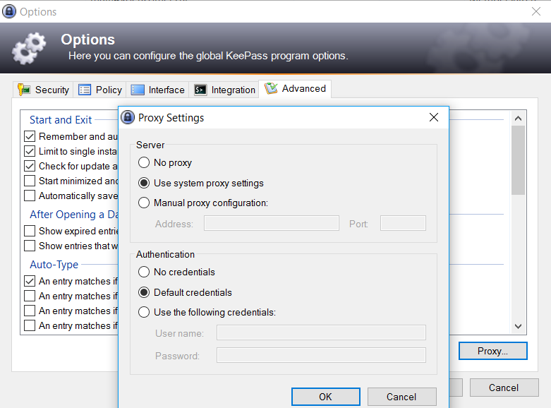

# KeePass OneDrive Sync

## Configuration options

Under Tools -> OneDrive Sync Options you will find all the KeePass databases that are set up for synchronization through the plugin. Note that the local file path is the key of the configuration for the synchronization. This means that if you would move the locally stored KeePass database, you will have to set up the synchronization with OneDrive again.

In this configuration window you can right click on an entry to get a context menu with options for that specific KeePass database.

I.e. you can choose to delete configuration of KeePass databases you no longer want to synchronize (keyboard shortcut DEL). You can also force a synchronization to happen or view the underlying details of a synchronization as to which OneDrive it is being synced to and to which folder.

You can also choose to view more details on the configuration kept for a KeePass database synchronization (keyboard shortcut ENTER).

## HTTP Proxies

If you're using a HTTP proxy to communicate with the internet, configure the HTTP proxy in KeePass under Tools > Options > Advanced tab > Proxy at the bottom right. The KeePassOneDriveSync plugin fully supports the use of HTTP proxies and will automatically take over these proxy settings.

## Offline mode

Starting with version 2.0.0.0 an option has been added under the File menu to temporarily mark the KeeOneDriveSync plugin for offline mode. This means no attempts will be made to synchronize the database after opening or saving it. This setting is not retained after restarting KeePass. It could be useful if your connection isn't ideal for syncing and you have to make a lot of changes.

## SharePoint 2013, 2016 and SharePoint Online support

Starting with version 2.0.0.0 it is now also possible to sync your KeePass database with SharePoint. As the Microsoft Graph API support for SharePoint is still very limited and I wanted to support on premises farms as well, I've chosen to implement CSOM with Low Trust oAuth to access SharePoint. This means you will manually have to set up the oAuth token and your SharePoint farm needs to support the Low Trust (ACS) oAuth scenario for SharePoint. I will soon extend this information with how to configure oAuth. I will also attempt to add support for High Trust oAuth as that's more typically being used with on premises SharePoint farms.