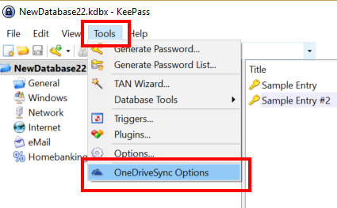

# KeePass OneDrive Sync

## Configuration options

Under Tools -> OneDrive Sync Options you will find all the KeePass databases that are set up for synchronization through the plugin. Note that the local file path is the key of the configuration for the synchronization. This means that if you would move the locally stored KeePass database, you will have to set up the synchronization with OneDrive again.

In this configuration window you can right click on an entry to get a context menu with options for that specific KeePass database.

I.e. you can choose to delete configuration of KeePass databases you no longer want to synchronize (keyboard shortcut DEL). You can also force a synchronization to happen or view the underlying details of a synchronization as to which OneDrive it is being synced to and to which folder.

You can also choose to view more details on the configuration kept for a KeePass database synchronization (keyboard shortcut ENTER).

## HTTP Proxies

If you're using a HTTP proxy to communicate with the internet, configure the HTTP proxy in KeePass under Tools > Options > Advanced tab > Proxy at the bottom right. The KeePassOneDriveSync plugin fully supports the use of HTTP proxies and will automatically take over these proxy settings.

## Offline mode

Starting with version 2.0.0.0 an option has been added under the File menu to temporarily mark the KeeOneDriveSync plugin for offline mode. This means no attempts will be made to synchronize the database after opening or saving it. This setting is not retained after restarting KeePass. It could be useful if your connection isn't ideal for syncing and you have to make a lot of changes.

## SharePoint 2013, 2016 and SharePoint Online support

Starting with version 2.0.0.0 it is now also possible to sync your KeePass database with SharePoint. As the Microsoft Graph API support for SharePoint is still very limited and I wanted to support on premises farms as well, I've chosen to implement SharePoint REST API calls with Low Trust oAuth to access SharePoint. This makes it fully asynchronous, support the KeePass proxy configuration and very little data traffic will be used. This also means you will manually have to set up the oAuth token and your SharePoint farm needs to support the Low Trust (ACS) oAuth scenario for SharePoint. You can set up an oAuth token only if you're a site collection administrator of the SharePoint site where you want to store the KeePass database. If you are, then follow these steps to set up the token:

1. Go to <sharepoint site collection URL>/_layouts/appregnew.aspx
2. Click on the Generate button next to both the Client Id and Client Secrets fields
3. Enter anything you'd like in the Title field, i.e. 'KeeOneDriveSync Token'
4. Enter anything you want in the App Domain field. This value is not used but must be filled out. I.e. 'github.com'
5. Enter anything you want in the Redirect URI field. This value is not used but must be filled out. I.e. 'https://github.com'
6. Click on the Create button
7. Make a copy of the Client Id and Client Secret values somewhere, i.e. in notepad
8. Go to <sharepoint site collection URL>/_layouts/appinv.aspx
9. Paste the Client Id from the previous steps in the App Id field and click on Lookup
10. In the Permission Request XML field paste:

  <AppPermissionRequests AllowAppOnlyPolicy="true">
    <AppPermissionRequest Scope="http://sharepoint/content/sitecollection/web" Right="FullControl" />
  </AppPermissionRequests>

11. Click on the Create button
12. Consent to the trust dialog
13. You can now set up a sync with SharePoint in KeePass using the Client Id, Client Secret and the SharePoint Site URL

Few notes:
- You only need to perform these steps once
- Unlimited users can use this Client Id  / Client Secret token to sync the KeePass database
- The Client Id / Client Secret gives full access to the entire site (not site collection), so beware that by giving them to others, you give access to them to access, modify or delete any file in the same site
- Low Trust OAuth tokens expire automatically after 1 year. Instructions on how to [renew the token can be found here](https://docs.microsoft.com/en-us/sharepoint/dev/sp-add-ins/replace-an-expiring-client-secret-in-a-sharepoint-add-in). If you find these steps too complex, you can also just repeat the step above to generate a new Client Id / Client Secret which will be valid for a year again.
- If you believe the Client Id / Client Secret have been compromised by someone that shouldn't have access, you can simply revoke the oAuth trust by going to <sharepoint site collection URL>/_layouts/appprincipals.aspx and click on the black X in front of the token you wish to revoke. It will show up using the name you've provided at step 3.

I will also attempt to add support for High Trust oAuth at a later stage as that's more typically being used with on premises SharePoint farms.