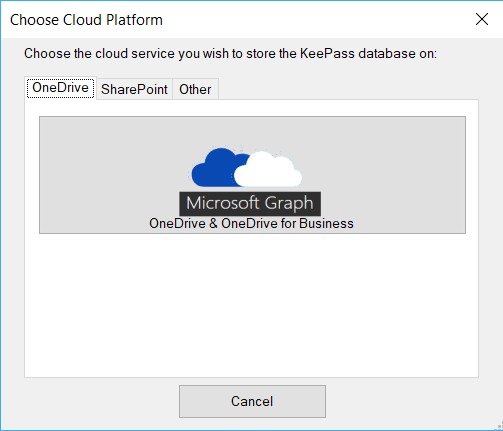
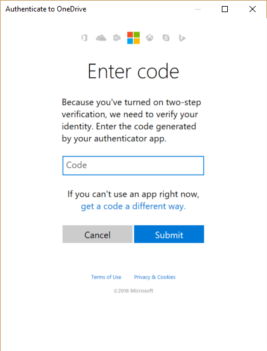
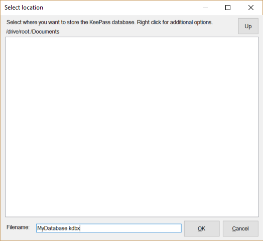

# KeePass OneDrive Sync

## Installation instructions

1. [Download the plugin PLGX file from GitHub](https://github.com/KoenZomers/KeePassOneDriveSync/raw/master/KeeOneDriveSync.plgx) OR if having problems using the PLGX file, alternatively [download the DLLs in the ZIP file](https://github.com/KoenZomers/KeePassOneDriveSync/raw/master/KeeOneDriveSync.zip). You need either, not both.
2. Copy the PLGX file into the KeePass 2 installation folder or when using the ZIP file, extract all DLLs from it and copy all of them into your KeePass 2 installation folder. Typically this is C:\Program Files (x86)\KeePass Password Safe 2
3. Start KeePass, it should parse the plugin. You can verify if the plugin was loaded successfully by going to Tools -> Plugins and verifying that an enty named "KoenZomers.KeePass.OneDriveSync" is present 
 
4. Create a new KeePass database (use File -> New), open an already existing locally stored KeePass database (use File -> Open -> Open File) or download a KeePass database directly from OneDrive or OneDrive for Business (use File -> Open -> Open from OneDrive). Do not store the KeePass database on your PC where you are also using the native OneDrive sync tool (Next Generation Sync Client) to sync your files as this will mess up things. KeePass OneDriveSync will take care of synchronizing your database instead. Due to having a local copy of the KeePass database you are also able to access your database when you (temporarily) do not have an internet connection.
5. When you open an existing KeePass database, it will ask you if you want to connect it to OneDrive. Make sure Yes is selected and click OK. If you choose to create a new KeePass database, as soon as you save it for the first time, it will ask you if you want to connect it to OneDrive. Select Yes and click OK. 
6. Select if you want to sync the KeePass database with OneDrive Consumer or OneDrive for Business. Note that OneDrive for Business on on premises SharePoint 2013 and SharePoint 2016 farms is not supported, only on Office 365. 
7. Log in to the OneDrive or OneDrive for Business where you want to sync your KeePass database to. . Multi Factor Authentication on OneDrive and OneDrive for Business on Office 365 is also supported in case you have enabled that on your Microsoft Account (recommended - [more info](http://windows.microsoft.com/en-us/windows/two-step-verification-faq)).

8. Give consent to the plugin being able to access and update your files on OneDrive. This is required for the plugin to work. Only the local plugin on your PC will then be able to access your OneDrive. It doesn't go through any server from me neither do your credentials or access/refresh tokens get shared with anyone or anything. 
9. Navigate to the location on OneDrive where you want to store the KeePass database. Either select an existing file that you wish to overwrite or type in a filename in the filename textbox at the bottom to upload the KeePass database under the current folder with that name.

10. You're now ready to use KeePass. If you make changes to your KeePass file and save it, it will automatically sync it with the version on OneDrive. If you open the KeePass database locally, it will automatically check OneDrive if there's an updated version and only if so, it will sync it.
