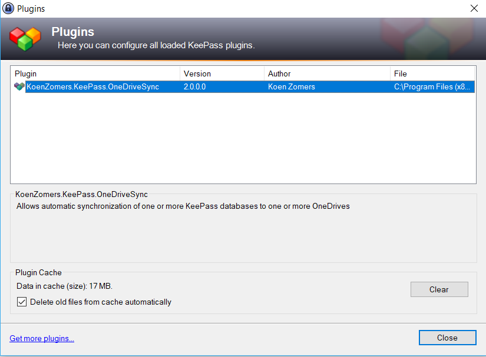

# KeePass OneDrive Sync

## Installation instructions

To add the plugin to KeePass, simply follow these steps:

1. [Download the plugin PLGX file from GitHub](../../releases/latest) 
2. Copy the PLGX file into the Plugins folder under the folder where keepass.exe resides. For the installable version of KeePass this will typically be C:\Program Files (x86)\KeePass Password Safe 2\Plugins.
3. Start KeePass, it should parse the plugin. You can verify if the plugin was loaded successfully by going to Tools -> Plugins and verifying that an enty named "KoenZomers.KeePass.OneDriveSync" is present 
 

Once the plugin is installed, you can use one of the following scenarios to start using the plugin:

### Opening an existing KeePass database from OneDrive Personal / OneDrive for Business in Office 365 / SharePoint Online / SharePoint on-premises

1. In KeePass go to File > Open > Open from OneDrive 
2. Choose the platform where you have stored your KeePass database. Choose Microsoft Graph API for both OneDrive Personal as well as OneDrive for Business. Choose SharePoint to sync with a KeePass database stored in a SharePoint on-premises or Online farm which is set up to use Low Trust oAuth. Check [these steps](./Configuration.md#sharepoint-2013-2016-and-sharepoint-online-support) to set up access for SharePoint.
3. Go throught the steps to authenticate to the platform and choose your KeePass database
4. Select a location locally where you want to store the KeePass database. This should *NOT* be a location that's also synced with the OneDrive.exe sync client as this *will* corrupt your KeePass database.

### Creating a new KeePass database on OneDrive Personal / OneDrive for Business in Office 365 / SharePoint Online / SharePoint on-premises
1. In KeePass go to File > New
2. Select a location on your machine to store the KeePass database. This should *NOT* be a location that's also synced with the OneDrive.exe sync client as this *will* corrupt your KeePass database.
3. Change the configuration options for your KeePass database as you wish
4. Hit CTRL+S to initiate saving the database. The OneDriveSync plugin should now appear asking you if you want to store the database on a cloud platform.
5. Choose the platform where you want to store your KeePass database. Choose Microsoft Graph API for both OneDrive Personal as well as OneDrive for Business. Choose SharePoint to sync with a KeePass database stored in a SharePoint on-premises or Online farm which is set up to use Low Trust oAuth. Check [these steps](./Configuration.md#sharepoint-2013-2016-and-sharepoint-online-support) to set up access for SharePoint.
6. Go throught the steps to authenticate to the platform and choose your KeePass database

### Synchronising an existing local KeePass database with OneDrive Personal / OneDrive for Business in Office 365 / SharePoint Online / SharePoint on-premises
1. In KeePass go to File > Open
2. Select the location of the KeePass database on our local machine. This should *NOT* be a location that's also synced with the OneDrive.exe sync client as this *will* corrupt your KeePass database.
3. Hit CTRL+S to initiate saving the database. The OneDriveSync plugin should now appear asking you if you want to store the database on a cloud platform.
4. Choose the platform where you want to store your KeePass database. Choose Microsoft Graph API for both OneDrive Personal as well as OneDrive for Business.  Choose SharePoint to sync with a KeePass database stored in a SharePoint on-premises or Online farm which is set up to use Low Trust oAuth. Check [these steps](./Configuration.md#sharepoint-2013-2016-and-sharepoint-online-support) to set up access for SharePoint.
5. Go throught the steps to authenticate to the platform and choose where to store your KeePass database