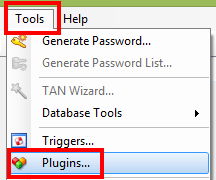
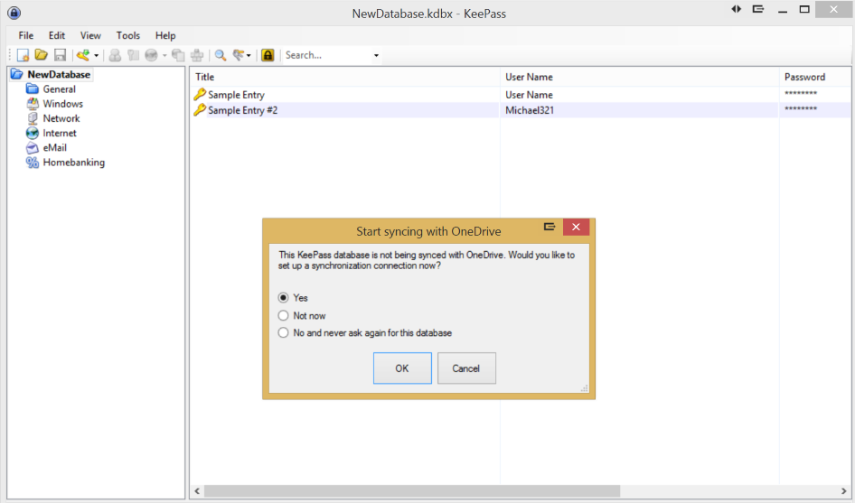
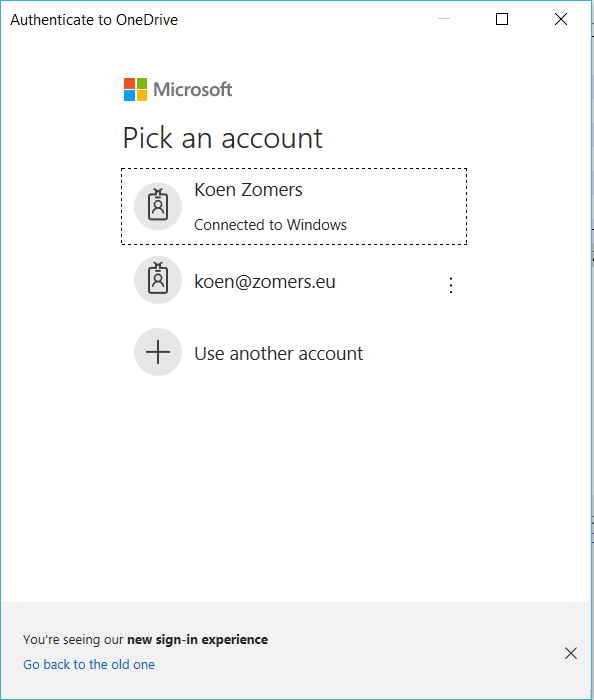
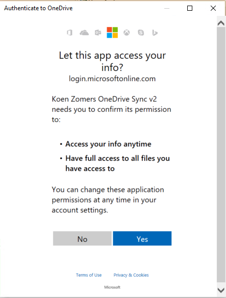
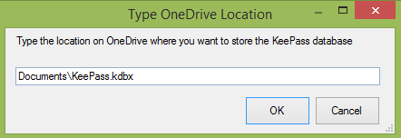
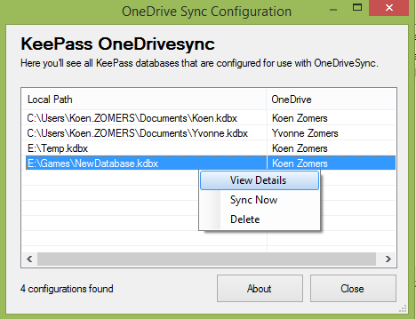
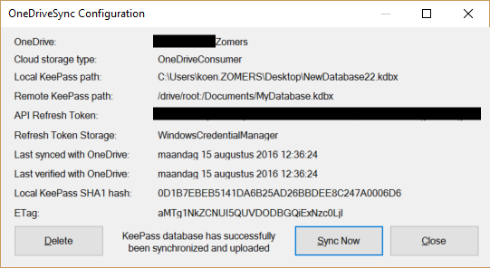

# KeePass OneDrive Sync

I've created a free plugin for KeePass that allows syncing of multiple password databases from multiple OneDrives to a local version. It allows you to synchronize an unlimited amount of KeePass datbases with an unlimited amount of OneDrives. So i.e. you can synchronize your personal KeePass database with your personal OneDrive and your work related KeePass with a OneDrive that is shared among your colleagues, if you wish.

## Installation instructions

1. [Download the plugin file from GitHub](https://github.com/KoenZomers/KeePassOneDriveSync/raw/master/KeeOneDriveSync.plgx)
2. Copy the file into the KeePass 2 installation folder. Typically this is C:\Program Files (x86)\KeePass Password Safe 2
3. Start KeePass, it should parse the plugin. You can verify if the plugin was loaded successfully by going to Tools -> Plugins and verifying that an enty named "KoenZomers.KeePass.OneDriveSync" is present 
 
4. Create a new KeePass database or open an already existing locally stored KeePass database. It's currently not yet supported to open a KeePass database directly from OneDrive, so manually download it first as a one time action.
5. When you open an existing KeePass database, it will ask you if you want to connect it to OneDrive. Make sure Yes is selected and click OK. If you choose to create a new KeePass database, as soon as you save it for the first time, it will ask you if you want to connect it to OneDrive. Select Yes and click OK. 
6. Log in to the OneDrive where you want to sync your KeePass database to. . Multi Factor Authentication on OneDrive is also supported.

7. Give consent to the plugin being able to access and update your files on OneDrive. This is required for the plugin to work. Only the local plugin on your PC will then be able to access your OneDrive. It doesn't go through any server from me neither do your credentials or access/refresh tokens get shared with anyone or anything. 
8. Type the path on OneDrive where you want to store the KeePass database. I.e. if you have a folder named KeePass in your OneDrive root and you wish to store the database named as Passwords.kdbx, enter KeePass\Passwords.kdbx. If a KeePass database already exists at the path you specify, it will be synced with the local KeePass database you just opened. If it doesn't exist yet on OneDrive, the local KeePass database will be copied to it and synced from thereon. I hope to replace this screen with an easier to use OneDrive file browser in the future. 
9. You're now ready to use KeePass. If you make changes to your KeePass file and save it, it will automatically sync it with the version on OneDrive. If you open the KeePass database locally, it will automatically check OneDrive if there's an updated version and only if so, it will sync it.

## Configuration Options

Under Tools -> OneDrive Sync Options you will find all the KeePass databases that are set up for synchronization through the plugin. Note that the local file path is the key of the configuration for the synchronization. This means that if you would move the locally stored KeePass database, you will have to set up the synchronization with OneDrive again.

In this configuration window you can right click on an entry to get a context menu with options for that specific KeePass database.

I.e. you can choose to delete configuration of KeePass databases you no longer want to synchronize (keyboard shortcut DEL). You can also force a synchronization to happen or view the underlying details of a synchronization as to which OneDrive it is being synced to and to which folder.

You can also choose to view more details on the configuration kept for a KeePass database synchronization (keyboard shortcut ENTER).

## Checking for updates

You can easily check from within KeePass if there are updates for this plugin available. Just open KeePass, go to Help on the top menu and click on Check for Updates.

Here it will perform a check for KeePass itself and all installed plugins if they're up to date.

If a new version is available, just come to this page again, download the latest plugin and overwrite the PLGX file in your KeePass installation folder.

## Todo

On my todo list are still:

1. Add a OneDrive File browser for easier selection of a location on OneDrive 
2. Allow a KeePass database to be opened directly from OneDrive without the need to download it yourself first

## Special Thanks

Special thanks to Oleksandr Senyuk for making [KeeSkyDrive](http://sourceforge.net/projects/keeskydrive/) as it has inspired me to create this plugin.

## Feedback

Comments\suggestions\bug reports are welcome!

Koen Zomers
mail@koenzomers.nl
